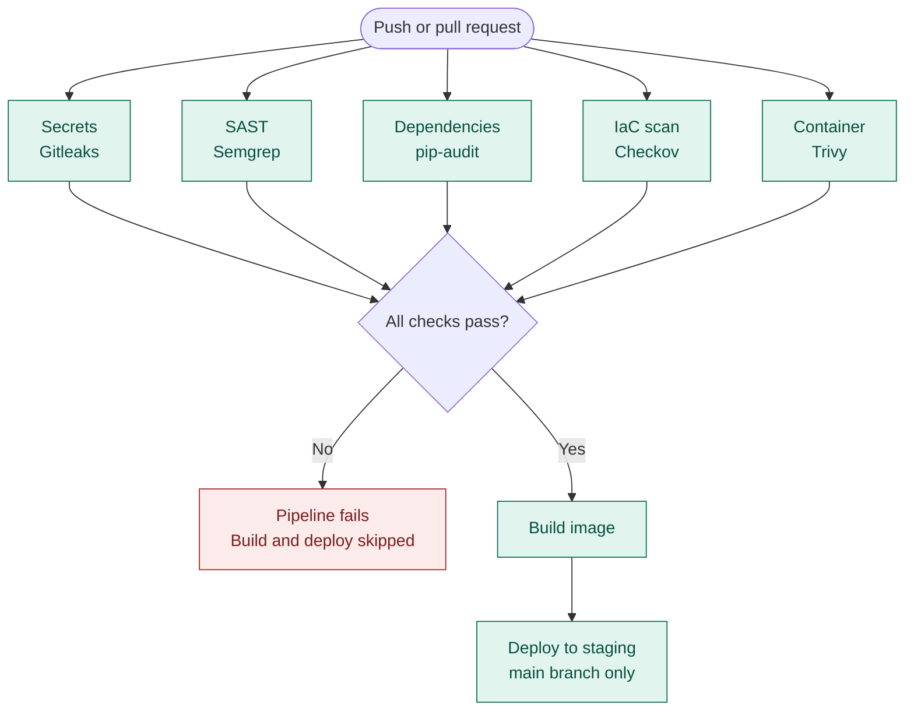

# 🔐 Secure CI/CD Pipeline With GitHub Actions (DevSecOps)


> ⚠️ **This repository contains intentionally vulnerable code.** It exists only to show that the pipeline catches real problems. Never deploy it or reuse any of its code.

## 📖 Overview

Modern cloud security lives inside pipelines, not after deployment. In this project I built a CI/CD pipeline on GitHub Actions that runs five automated security checks on every push and pull request, before the code can be built or deployed.

To prove the pipeline works, I wrote a deliberately vulnerable Flask application, an insecure Dockerfile, and an insecure Terraform file. The security gates scan all of them and stop the pipeline when they find serious issues. The build and deploy stages only run when every security check passes.

Everything uses free, open-source tools, and no cloud account is needed. The Terraform file is only scanned and never deployed.

## 🏗️ Pipeline workflow



## 🧱 Security gates

| # | Gate | Tool | What it scans | Fails the pipeline on |
|---|---|---|---|---|
| 1 | Secret scanning | Gitleaks | Whole repository and git history | Hardcoded secrets |
| 2 | SAST | Semgrep | `app/` source code | Insecure code patterns |
| 3 | Dependency scan | pip-audit | `app/requirements.txt` | Packages with known vulnerabilities |
| 4 | IaC scan | Checkov | `terraform/` | Public S3 access, SSH open to the world |
| 5 | Container scan | Trivy | `app/Dockerfile` and the built image | Root user, critical image vulnerabilities |

## 🐞 Intentional vulnerabilities

| Vulnerability | Where | Caught by |
|---|---|---|
| Hardcoded API key and password | `app/app.py` | Gitleaks |
| SQL injection | `/user` route | Semgrep |
| OS command injection (`shell=True`) | `/ping` route | Semgrep |
| Template injection / XSS | `/hello` route | Semgrep |
| Code injection (`eval`) | `/calc` route | Semgrep |
| Path traversal | `/file` route | Semgrep |
| Insecure deserialization (`pickle`) | `/load` route | Semgrep |
| Weak password hashing (MD5) | `/register` route | Semgrep |
| Debug mode on, bound to all interfaces | end of `app/app.py` | Semgrep |
| Old packages with known CVEs | `app/requirements.txt` | pip-audit, Trivy |
| Public S3 bucket ACL | `terraform/main.tf` | Checkov |
| SSH open to `0.0.0.0/0` | `terraform/main.tf` | Checkov |
| Container runs as root | `app/Dockerfile` | Trivy |

The tools report what they find in their own output, so the exact findings may differ slightly from this table.

## 🚦 Block vs warn

| Block (pipeline fails) | Warn (pipeline continues) |
|---|---|
| Secrets in code | Medium-severity dependency issues |
| SQL and command injection | Code quality issues |
| Public S3 buckets | Missing security headers |
| SSH open to 0.0.0.0/0 | Informational findings |
| Critical CVEs with a fix available | Documented false positives |
| Containers running as root | |

Thresholds depend on context: customer-facing apps need stricter rules than internal tools, and regulated industries need stricter controls and audit trails.

## 📂 Project structure

```
secure-cicd-pipeline/
├── .github/
│   └── workflows/
│       └── ci-cd-pipeline.yml   # The full pipeline
├── app/
│   ├── app.py                   # Intentionally vulnerable Flask app
│   ├── requirements.txt         # Intentionally outdated dependencies
│   └── Dockerfile               # Intentionally insecure (runs as root)
├── terraform/
│   └── main.tf                  # Intentionally insecure (scanned, never deployed)
├── screenshots/                 # Proof of the pipeline results
├── .gitignore
└── README.md
```

## ▶️ How to run it

1. Create a new public GitHub repository and push this project to it.
2. Open the **Actions** tab. The pipeline starts automatically on every push and pull request.
3. Open each failed job to see the findings from each tool.
4. To make the gates block merges, go to **Settings → Branches**, add a rule for `main`, and require the five security checks to pass.

## 🛠️ Fixing the findings

Once the pipeline fails as expected, fix the code and push again to turn the checks green:

- Remove the hardcoded secrets and read them from environment variables or GitHub Secrets. Rotate any secret that was ever committed.
- Use parameterized queries instead of string concatenation, and remove `eval`, `pickle.loads`, `shell=True` and `render_template_string` on user input.
- Hash passwords with a strong algorithm, turn off debug mode, and validate file paths.
- Upgrade the dependencies to current, patched versions.
- Make the S3 bucket private with a public access block, and restrict SSH to a known IP range.
- Add a non-root user to the Dockerfile and use a slim, up-to-date base image.

## 🧪 Results

<!-- Add your screenshots here after running the pipeline:


-->

## 🧠 Design decisions

- **Shift-left:** every check runs on the pull request, so problems are found while they are cheap to fix.
- **Parallel gates, sequential delivery:** the five checks run at the same time, and build and deploy depend on all of them (`needs:`).
- **Separate jobs per tool:** a developer can see exactly which check failed, and each one can be marked as a required status check.
- **Fix, don't ignore:** unfixed image vulnerabilities are ignored to avoid blocking developers on things they cannot fix, but everything else blocks.
- **Deploy only from `main`:** the staging job is limited to the `main` branch and uses a GitHub environment, so approvals can be added later.

## 📚 Tools used

Gitleaks · Semgrep · pip-audit · Checkov · Trivy · GitHub Actions · Docker · Flask · Terraform (scan only)

## 👤 Author

**Harsh Singh**
Technical Engineer | VAPT | Aspiring Cloud & Application Security Engineer
